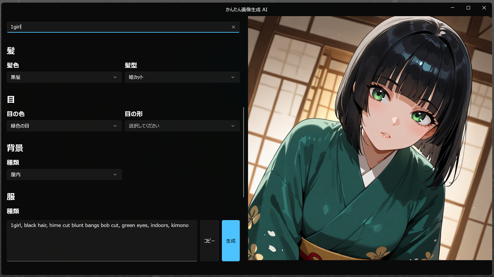
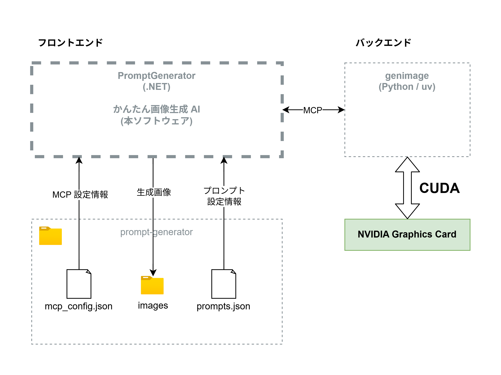

# PromptGenerator
[日本語](README.md) | English



PromptGenerator is a simple image generation tool that constructs a UI based on a prompt definition file, enabling easy image generation through a local AI environment.

## System Overview


## Installation Requirements
- Windows 11 installed
- A PC equipped with an NVIDIA GPU
- `uv` command installed
- [genimage](https://github.com/Himeyama/genimage) installed
- Model files prepared

## Runtime Requirements
- Prompt definition file placed in the correct directory
- MCP configuration completed

## Prompt Definition File
Prompt definitions are stored in: `C:\Users<USERNAME>\prompt-generator\prompts.json`

### Example Prompt Configuration
See: [prompts.json](docs/prompts.json)

## MCP Configuration
PromptGenerator communicates with [genimage](https://github.com/Himeyama/genimage) via MCP (Model Context Protocol).  
Therefore, an MCP configuration file is required.

Create the configuration file at: `C:\Users<USERNAME>\prompt-generator\mcp_config.json`

If `genimage` is installed on Windows, an example configuration is:

```json
{
  "mcpServers": {
    "genimage": {
      "command": "uv",
      "args": [
        "run",
        "--directory",
        "C:/Users/<USERNAME>/genimage",
        "python",
        "-m",
        "main",
        "--model",
        "models/<MODEL>.safetensors",
        "--mcp"
      ]
    }
  }
}
```

## Output Images
Generated images appear on the right side of the application UI, and are also saved to: `C:\Users\<USERNAME>\prompt-generator\images\`

## Disclaimer
The developers assume no responsibility for any damages resulting from the use of this software.

### Responsibility Regarding Generated Images
- The developers make no guarantees regarding the copyright status, legality, or accuracy of any images or data generated by this software.
- The developers bear no responsibility for copyright infringement, violation of portrait rights, trademark infringement, or any other legal issues caused by generated content.
- Publishing, distributing, or commercially using any generated content is entirely the responsibility of the user.

### Responsibility Regarding Models and External Software
- Any legal issues, misuse, or license violations involving the models used (e.g., Stable Diffusion–based models) are the sole responsibility of the user.
- The developers are not responsible for the behavior, licensing, or problems caused by external tools such as genimage.

### Responsibility for System Environment and Data Loss
The developers assume no liability for:

- PC malfunctions
- Data loss
- System errors

Performance degradation or any other issues caused by using this software.

No guarantee is provided regarding the software’s performance, stability, or functionality.

### Support and Updates
This software is provided as-is.
The developers do not guarantee any bug fixes, feature updates, or ongoing support.

### User Responsibility
Usage of this software is entirely at the user’s own discretion and responsibility.
Users must comply with all applicable laws, platform rules, model licenses, and software guidelines.

### Copyright Guidelines
This software runs image generation models locally on the user's PC.
Generated images are, in principle, owned by the user who generated them.

However, if an image resembles or reproduces elements of existing copyrighted works (anime, manga, games, etc.), it may constitute copyright infringement.

Such images must not be published in public spaces (SNS, websites, videos, printed materials, posters, etc.).

If a user publishes such infringing content, the responsibility lies entirely with the user, and the developers shall bear no responsibility.

Please publish or distribute generated images at your own risk.